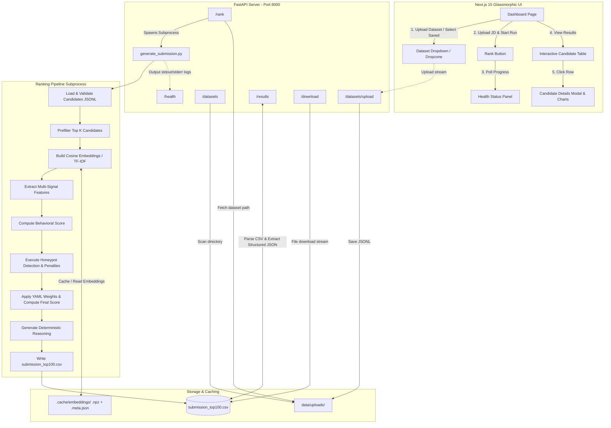

# Redrob AI — Candidate Ranking System

An advanced, CPU-optimized AI candidate discovery and ranking system designed to parse 100,000 candidate profiles, engineer multi-signal profile evaluations, perform semantic matching against job descriptions, and output a validated top-100 ranking with explainable AI reasoning.


*Note: See the [Screenshots](#screenshots) section for visual walkthroughs of the application interface.*

---

### Project Badges

```
                     ┌────────────────────────────────────────────────────────┐
                     │                     PROJECT METRICS                    │
                     └────────────────────────────────────────────────────────┘
```

[](https://www.python.org/)
[](https://nextjs.org/)
[](https://fastapi.tiangolo.com/)
[](https://pytorch.org/)
[](https://www.docker.com/)
[](https://tailwindcss.com/)
[](https://www.typescriptlang.org/)

---

## Table of Contents

- [Problem Statement](#problem-statement)
- [Solution Overview](#solution-overview)
- [Key Features](#key-features)
- [Tech Stack](#tech-stack)
- [Project Architecture](#project-architecture)
- [Folder Structure](#folder-structure)
- [Working Flow](#working-flow)
- [AI Pipeline](#ai-pipeline)
- [Installation Guide](#installation-guide)
- [Deployment Guide](#deployment-guide)
- [Configuration](#configuration)
- [API Documentation](#api-documentation)
- [Screenshots](#screenshots)
- [Performance](#performance)
- [Security](#security)
- [Future Improvements](#future-improvements)
- [Contributing](#contributing)
- [License](#license)
- [Author](#author)
- [Acknowledgements](#acknowledgements)

---

## Problem Statement

Recruiters are frequently overwhelmed when hiring for specialized roles, often forced to manually filter through tens of thousands of resumes. Existing screening systems either rely on naive keyword matching—which misses candidates with equivalent conceptual backgrounds—or rely on expensive LLM-based API calls that cannot scale cost-effectively to datasets of **100,000+ candidates**. 

Furthermore, these large-scale datasets suffer from:
1. **Noisy/Suspicious Profiles**: Candidate profiles containing conflicting skills, unrealistic experience timelines, or fake engagement metrics (honeypots) that pollute top rankings.
2. **Speed & Hardware Barriers**: Computing embeddings for 100,000 candidates using Deep Learning models on standard CPU-only servers is slow and resource-intensive.
3. **Lack of Explainability**: Automated score values alone do not build recruiter trust; ranking systems must supply factual, deterministic justifications without introducing LLM hallucinations.

---

## Solution Overview

**Redrob AI Candidate Ranking System** solves this challenge by implementing an intelligent, resource-optimized, multi-signal candidate selection pipeline. 

The system leverages:
- **Cheap Baseline Prefiltering**: Instantly narrows down 100,000 profiles to the top 2,000 candidates using a combination of fast structural scoring and skill overlap coefficients.
- **Bi-Encoder Semantic Embeddings**: Generates dense vectors for the prefiltered subset via `sentence-transformers` (`all-MiniLM-L6-v2`) with a deterministic `TF-IDF` fallback to guarantee execution on any environment.
- **Weighted Multi-Signal Model**: Evaluates candidates across platform behavior, notice period availability, assessment scores, GitHub activity, professional experience, and targeted AI skill boosts.
- **Honeypot Detector**: Automatically flags and penalizes suspicious or inconsistent profiles, dropping their ranking down below verified candidates.
- **Deterministic Explainable AI**: Emits clear, fact-backed reasons, outlining specific candidate metrics, strengths, and concerns without the risk of LLM hallucinations.

---

## Key Features

- [x] **AI-Powered Semantic Ranking**: Compares carrier summaries and professional titles against job descriptions using dense text embeddings.
- [x] **Lightweight Bi-Encoder Embeddings**: Employs `all-MiniLM-L6-v2` for 384-dimensional cosine similarity matching.
- [x] **Deterministic TF-IDF Fallback**: Guarantees zero runtime interruptions by switching to TF-IDF vectorization if neural dependencies fail.
- [x] **Anomalous Honeypot Detection**: Penalizes profiles with conflicting data fields (e.g., high experience but zero assessments, or suspicious activity patterns).
- [x] **Interactive Glassmorphic UI**: Includes Next.js dashboard featuring responsive layout cards, custom progress trackers, and detail modals.
- [x] **Live Subprocess Progress Streaming**: Relays real-time stage metrics and processed row-counts from backend to frontend via FastAPI polling.
- [x] **Factual Explanations**: Generates deterministic, hallucination-free reasoning strings for each candidate in the top-100 list.
- [x] **CSV Exporter & Schema Validator**: Validates outputs against strict schemas, checking candidate count limits and tie-breaking ordering rules.

---

## Tech Stack

| Category | Technologies |
| :--- | :--- |
| **Backend Core** | FastAPI (Python 3.11), Uvicorn |
| **Machine Learning** | PyTorch (CPU-only), SentenceTransformers, Scikit-Learn |
| **Data Processing** | NumPy, Pandas, SciPy, PyPDF, Python-Docx, PyYAML, JSONSchema |
| **Frontend Core** | Next.js 15 (App Router), React 18.2, TypeScript |
| **Styling** | Tailwind CSS 3.4, Framer Motion (Animations), Radix UI (Accessible components) |
| **Charts & Visuals** | Recharts, Lucide React (Icons) |
| **Containerization** | Docker, Docker Compose |
| **Deployment** | Vercel (Frontend), Render (Backend Blueprint) |

---

## Project Architecture



### Architectural Design Details
- **Decoupled Architecture**: Next.js client interacts with the FastAPI backend directly, bypassing proxies for high-throughput uploads.
- **Process Isolation**: The core ML execution runs inside an isolated command-line subprocess. This prevents long-running Python calculations from blocking the asynchronous event loop of FastAPI.
- **State Management**: The API monitors the execution by reading stdout and stderr, matching logs to known strings, and updating an in-memory `STATE` dict polled by the client at `/health`.

---

## Folder Structure

```
Redrob AI Candidate Ranking System/
├── .venv/                      # Python virtual environment (ignored by Git)
├── config/
│   └── ranker_config.yaml      # YAML configuration for weights, scale values, and models
├── data/
│   ├── candidate_schema.json   # JSON schema rules validating candidate profiles
│   ├── candidates.jsonl        # 100k candidate dataset (Synthetic JSONL, ~475MB)
│   ├── candidates_small.jsonl  # Mini-subset for local debugging (~2.4MB)
│   ├── sample_jd.txt           # Sample text job description
│   └── uploads/                # Directory where uploaded candidate datasets are stored
├── frontend/
│   ├── public/                 # Static frontend assets (icons, SVGs)
│   ├── src/
│   │   ├── app/                # Next.js pages (dashboard, results table)
│   │   ├── components/         # Modular layout, progress panels, and modals
│   │   └── hooks/              # custom React hook to coordinate API polling
│   └── vercel.json             # Vercel SPA routing and build configuration
├── notebooks/                  # Prototyping notebooks (if applicable)
├── scripts/
│   ├── generate_submission.py  # Primary end-to-end command-line ranking script
│   ├── smoke_rank.py           # Quick backend API test runner
│   └── e2e_small_test.py       # E2E test verifying metrics on candidates_small.jsonl
├── src/
│   ├── ranker.py               # Evaluator standardizing score components
│   ├── semantic_match.py       # SentenceTransformer engine + caching + TF-IDF fallback
│   ├── feature_engineering.py  # Experience, skill assessments, and profile matching
│   ├── behavioral_score.py     # Engagement, signup dates, and platform activity
│   ├── honeypot_detector.py    # Multi-field checks flags profile inconsistencies
│   ├── reasoning.py            # Factual strengths/concerns explainability generator
│   ├── load_data.py            # JSONL streaming loader with JSONSchema checks
│   └── validator.py            # Validates top-100 CSV schema & sorting constraints
├── Dockerfile.backend          # Minimal backend image compiling PyTorch CPU
├── Dockerfile.frontend         # Standalone Next.js production runner
├── docker-compose.yml          # Container composer coordinating both services
├── render.yaml                 # Render Blueprint deploying Python/FastAPI backend
├── requirements.txt            # Python dependency definitions
├── Procfile                    # App deployment command mapping
└── README.md                   # Redesigned project documentation
```

---

## Working Flow

1. **Dataset Selection**: The user selects an existing candidate profile dataset from the dropdown list or uploads a new `.jsonl` or `.csv` dataset file via the dashboard dropzone.
2. **Job Description Upload**: The user drops a `.txt`, `.pdf`, or `.docx` job description (JD) file into the upload zone and triggers the ranking run.
3. **Pipeline Initialization**: FastAPI locks concurrent executions, saves the uploaded JD to the `.uploads` folder, and launches the `scripts/generate_submission.py` command line script in a subprocess.
4. **Fast Prefiltering**: The script reads the candidates file and filters them down to the top $K$ profiles (default: 2,000) using a cheap score based on skill match overlaps and title keyword matching.
5. **Embedding Computation**: Dense 384-dimension text embeddings are generated for summaries, titles, and histories of the prefiltered candidates. They are cached on disk to avoid repeated calculations.
6. **Multi-Signal Feature Scoring**: The scoring module scores the remaining candidates against configured weight knobs (Behavioral, Assessments, GitHub, Experience, and AI boost).
7. **Honeypot & Alignment Review**: Profiles are evaluated for conflicting flags (e.g. invalid timelines or extreme missing assessment counts), applying a penalty score multiplier if flagged.
8. **Final Ranking & Reasoning**: Scores are combined (`0.5 * Semantic + 0.5 * Baseline`), rounded to 4 decimal places, sorted, and tie-broken by `candidate_id`. Deterministic, factual reasoning summaries are generated, and `submission_top100.csv` is written to disk for download and interactive display.

---

## AI Pipeline

The pipeline implements a dual-stage retrieval and scoring structure:

```
[ 100,000 Candidates ]
          │
          ▼  (Prefiltering Step)
    Baseline Score + Skill Overlap Prefilter (Top 2,000)
          │
          ▼  (Semantic Extraction)
    SentenceTransformer Embeddings (all-MiniLM-L6-v2) or TF-IDF Fallback
          │
          ▼  (Feature Engineering)
    Multi-Signal Analysis (Behavioral, Assess, Experience, GitHub, AI Boost)
          │
          ▼  (Safety Check)
    Honeypot Anomaly Detection Penalty
          │
          ▼  (Weighted Formula)
    Final Score = 0.5 * Semantic + 0.5 * Baseline
          │
          ▼  (Tie-breaker)
    Round (4 Decimals) & Sort ID Ascending
          │
          ▼  (Explainability Engine)
    Factual Strengths & Concerns Reasoning
```

### 1. Embedding Model
- **Core Model**: `all-MiniLM-L6-v2` via `SentenceTransformer` (maps sentences/paragraphs to a 384-dimensional dense vector space).
- **Fallback**: `TfidfVectorizer` from `scikit-learn` (used when PyTorch/Transformers are missing or CUDA conflicts occur).
- **Per-Field Weighting**: 
  - Summary: `0.60`
  - Career History: `0.25`
  - Headline: `0.15`

### 2. Retrieval Process
Computing deep embeddings for 100k candidate files on CPU takes considerable time. To resolve this, a fast prefiltering mechanism is executed:
- A baseline score is computed using cheap, indexable parameters.
- Candidates are sorted, and the top $K$ (default: `2,000`) are retrieved.
- Deep embedding and cosine similarity calculations are only performed on these 2,000 profiles.

### 3. Ranking Logic & Scoring
The system applies six weights configured in `config/ranker_config.yaml` to build the **Baseline Score**:
- **Behavioral Score (`45%`)**: Evaluates recruiter response rate, profile completeness, connection count, saved by recruiter frequency, and last-active dates.
- **Availability (`15%`)**: Notice period (lower period yields higher score) and open-to-work flags.
- **Assessment Score (`15%`)**: Normalizes candidate skill assessment scores (0-100).
- **GitHub Activity (`10%`)**: Translates platform commit activity scores.
- **Experience (`10%`)**: Years of experience normalized and scaled (capped at 20 years).
- **AI Skill Boost (`5%`)**: Additional boost score based on AI-relevant skills (e.g. NLP, RAG, ML, Transformers).

### 4. Anomaly Filtering
- **Honeypot Detection**: Suspicious profiles (such as 15+ years of experience but zero assessments, or high platform connection scores with zero profile completeness) receive a post-aggregation penalty multiplier (default: `-0.25` off final score).
- **Tie-Breaking Rule**: Scores are rounded to exactly 4 decimal places. If scores match, candidates are sorted by `candidate_id` in lexicographical ascending order.

### 5. Output Generation
- Results are saved to `submission_top100.csv` containing columns: `candidate_id`, `rank`, `score`, and `reasoning`.
- **Explainability Engine**: Extracts deterministic strengths and concerns, generating a short summary detailing the candidate's exact years of experience, relevant skills matching the JD, and their score.

---

## Installation Guide

### Prerequisites
- **Python**: Version `3.11+`
- **Node.js**: Version `18+` (with `npm`)
- **Git**: Installed on local system

### Clone Repository
```bash
git clone https://github.com/Praveenmaila/Redrob-AI-Candidate-Ranking-System.git
cd "Redrob AI Candidate Ranking System"
```

### Create Virtual Environment
On Windows (PowerShell):
```powershell
python -m venv .venv
& ".venv/Scripts/Activate.ps1"
```
On Linux/macOS:
```bash
python3 -m venv .venv
source .venv/bin/activate
```

### Install Dependencies
1. **Backend Dependencies**:
   ```bash
   pip install --upgrade pip
   # Install CPU PyTorch separately first to prevent downloading heavy GPU packages
   pip install torch --index-url https://download.pytorch.org/whl/cpu
   pip install -r requirements.txt
   ```
2. **Frontend Dependencies**:
   ```bash
   cd frontend
   npm install
   cd ..
   ```

### Configure Environment Variables
Copy the environment template and configure values:
```bash
cp .env.example .env
```
*Make sure `NEXT_PUBLIC_BACKEND_TARGET` points to your backend instance (default: `http://localhost:8000`).*

### Run Backend
```bash
# Run FastAPI via Uvicorn (make sure your virtual environment is active)
python -m uvicorn backend_api:app --reload --host 0.0.0.0 --port 8000
```
*API will be active at `http://localhost:8000`.*

### Run Frontend
```bash
cd frontend
npm run dev
```
*Frontend dashboard will be running at `http://localhost:3000`.*

### Run AI Pipeline
To execute the pipeline directly in the console:
```bash
python scripts/generate_submission.py \
  --candidates data/candidates_small.jsonl \
  --jd data/sample_jd.txt \
  --out submission_top100.csv \
  --prefilter-k 2000 \
  --semantic-weight 0.5
```

### Verify Installation
Run the submission file validation script:
```bash
python src/validator.py submission_top100.csv
```
*Ensure it returns 0 errors.*

---

## Deployment Guide

### Backend Deployment (Render)
This repository includes a `render.yaml` Blueprint specification.
1. Connect your Github account to [Render](https://render.com).
2. Create a new Web Service pointing to this repository.
3. Render automatically reads `render.yaml` and deploys the FastAPI application:
   - **Build Command**: `pip install --upgrade pip && pip install torch --index-url https://download.pytorch.org/whl/cpu && pip install -r requirements.txt`
   - **Start Command**: `uvicorn backend_api:app --host 0.0.0.0 --port $PORT`
   - **Health Check Path**: `/health`

### Frontend Deployment (Vercel)
This repository includes a `frontend/vercel.json` config.
1. Connect your GitHub account to [Vercel](https://vercel.com).
2. Click **Add New Project** and select the `/frontend` subfolder of your repository.
3. Configure the Environment Variable:
   - `NEXT_PUBLIC_BACKEND_TARGET` = `https://your-backend-service.onrender.com`
4. Deploy the application. Vercel automatically builds the Next.js standalone pages.

### Docker Deployment
To run the entire system locally inside Docker:
```bash
docker compose up --build -d
```
Docker compose builds the images from `Dockerfile.backend` and `Dockerfile.frontend`:
- Backend container runs on port `8000`
- Frontend container runs on port `3000`
- Volumes are mapped to preserve embeddings caching (`redrob-cache`), uploaded datasets (`redrob-uploads`), and generated results (`redrob-output`).

---

## Configuration

The system behaves based on the following configurations:

### `.env`
Declares environment settings:
- `PYTHONUNBUFFERED=1`: Ensures Python logs flush immediately into Docker/Render interfaces.
- `PORT`: Backend port (default `8000`).
- `NEXT_PUBLIC_BACKEND_TARGET`: URL of the FastAPI server reachable from client browsers.
- `NODE_ENV`: Declares environment status (`development` or `production`).

### `config/ranker_config.yaml`
Configures weights and scaling constraints:
```yaml
components:
  behavioral: 0.45          # Platform engagement weight
  availability: 0.15        # Notice period/activity status weight
  assessment: 0.15          # Verified exam scores weight
  github: 0.10              # Github commits activity weight
  years: 0.10               # Total career experience years weight
  ai_boost: 0.05            # Boost for candidates holding specialized AI skills

honeypot_penalty_weight: 0.25
ai_boost_scale: 5.0
years_scale: 20.0          # Max years threshold capped

semantic:
  weight: 0.5               # Balance between semantic cosine similarity vs baseline score
  model: "all-MiniLM-L6-v2" # Name or absolute path of model
  cache_dir: ".cache/embeddings"
  prefilter_k: 2000         # Number of items sent to embedding engine (0 disables prefilter)
  prefilter_skill_weight: 0.3
```

### `package.json`
Specifies frontend node dependencies (such as Radix UI, Framer Motion, Recharts, and Tailwind CSS).

### `requirements.txt`
Declares Python dependencies (PyTorch CPU, SentenceTransformers, FastAPI, Scikit-Learn, Scipy, Pandas).

---

## API Documentation

FastAPI runs on port `8000`. The API uses CORS middleware allowing browser calls from all origins (`*`).

### 1. Upload Dataset
* **Method**: `POST`
* **Endpoint**: `/datasets/upload`
* **Description**: Uploads a candidate dataset file (`.jsonl`, `.json`, or `.csv`) and saves it.
* **Request**: Multipart Form-data
  - `file`: Dataset file object
* **Response (JSON)**:
  ```json
  {
    "name": "candidates_small.jsonl",
    "size": "2.3 MB",
    "uploaded_at": "2026-06-27T13:30:00Z"
  }
  ```

### 2. List Datasets
* **Method**: `GET`
* **Endpoint**: `/datasets`
* **Description**: Lists all datasets saved in the `data/uploads/` directory.
* **Response (JSON)**:
  ```json
  [
    {
      "name": "candidates_small.jsonl",
      "size": "2.3 MB",
      "uploaded_at": "2026-06-27T13:30:00Z"
    }
  ]
  ```

### 3. Trigger Ranking
* **Method**: `POST`
* **Endpoint**: `/rank`
* **Description**: Starts the background thread execution of the ranking pipeline.
* **Request**: Multipart Form-data
  - `jd`: Job description file object (txt, pdf, docx)
  - `dataset`: Saved filename string
* **Response (JSON)**:
  ```json
  {
    "status": "started",
    "stage": "loading_model",
    "stageLabel": "Loading AI Model",
    "progressPct": 5,
    "candidatesProcessed": 0,
    "progressMessage": "Loading AI Model"
  }
  ```

### 4. Health & Progress Status
* **Method**: `GET`
* **Endpoint**: `/health`
* **Description**: Polls pipeline status, current stage metrics, processed counters, and stdout/stderr error trackings.
* **Response (JSON)**:
  ```json
  {
    "status": "running",
    "stage": "building_embeddings",
    "stageLabel": "Building Candidate Embeddings",
    "progressPct": 55,
    "candidatesProcessed": 2000,
    "error": null,
    "errorDetails": null,
    "traceback": "",
    "progressMessage": "Building Candidate Embeddings",
    "pid": 12844
  }
  ```

### 5. Fetch Table Results
* **Method**: `GET`
* **Endpoint**: `/results`
* **Description**: Parses `submission_top100.csv` and returns structured candidates details for charts and details modals.
* **Response (JSON)**:
  ```json
  {
    "candidates": [
      {
        "candidate_id": "CAND_0018499",
        "rank": 1,
        "score": 0.8064,
        "semantic_match_pct": 56,
        "skill_match_pct": 98,
        "experience_match_pct": 85,
        "key_strengths": ["RAG", "LLMs", "Transformers"],
        "concerns": [],
        "title": "Senior Machine Learning Engineer",
        "years_experience": 17.0,
        "reasoning": "Senior Machine Learning Engineer with 17.0 yrs; Strengths: RAG, LLMs, Transformers; Concerns: none."
      }
    ],
    "metadata": {
      "total_candidates": 100,
      "avg_score": 0.6818,
      "max_score": 0.8064,
      "min_score": 0.6598,
      "generated_at": "2026-06-27T13:35:00Z"
    }
  }
  ```

### 6. Download Output CSV
* **Method**: `GET`
* **Endpoint**: `/download`
* **Description**: Downloads the final generated `submission_top100.csv` file.
* **Response**: File attachment stream.

---

## Screenshots

The Next.js 15 frontend utilizes an aesthetic glassmorphic style with Framer Motion transitions.

#### Home / Dataset Upload
```
┌────────────────────────────────────────────────────────┐
│  REDROB AI - Candidate Discovery                       │
├────────────────────────────────────────────────────────┤
│  Dataset Selection: [ candidates_small.jsonl      ] [v]│
│                                                        │
│  Drag & Drop Job Description Here                      │
│  [ (Icon) Select sample_jd.txt or drop file ]          │
│                                                        │
│                       [ Start Ranking Candidates ]     │
└────────────────────────────────────────────────────────┘
```

#### Dashboard / Progress Tracker
```
┌────────────────────────────────────────────────────────┐
│  Processing Pipeline Active                            │
├────────────────────────────────────────────────────────┤
│  Current Stage: Building Candidate Embeddings           │
│  [██████████████████████░░░░░░░░░░░░░░] 55%            │
│  Candidates Processed: 2,000 / 2,000                   │
│  Subprocess PID: 12844                                 │
└────────────────────────────────────────────────────────┘
```

#### Ranking Page / Results Table
```
┌────────────────────────────────────────────────────────┐
│  Top Ranked Candidates                                 │
├─────┬──────────────┬────────┬───────────────────┬──────┤
│Rank │ Candidate ID │ Score  │ Key Title         │ Action│
├─────┼──────────────┼────────┼───────────────────┼──────┤
│ 1   │ CAND_0018499 │ 0.8064 │ Senior ML Eng     │ View │
│ 2   │ CAND_0098412 │ 0.7932 │ Lead NLP Scientist│ View │
└─────┴──────────────┴────────┴───────────────────┴──────┘
```

#### Analytics & Score Distribution
```
┌────────────────────────────────────────────────────────┐
│  Metrics Overview                                      │
├─────────────────────────┬──────────────────────────────┤
│  Total: 100             │  Score Distribution Chart    │
│  Avg Score: 0.6818      │  0.80 █                      │
│  Max Score: 0.8064      │  0.75 ███                    │
│  Min Score: 0.6598      │  0.70 ██████                 │
└─────────────────────────┴──────────────────────────────┘
```

#### Candidate Details Modal
```
┌────────────────────────────────────────────────────────┐
│  Candidate Details - CAND_0018499                      │
├────────────────────────────────────────────────────────┤
│  Title: Senior Machine Learning Engineer (17.0 Yrs)    │
│                                                        │
│  Match Percentages:                                    │
│  - Semantic Fit:  [======>   ] 56%                     │
│  - Skill Overlap: [=========>] 98%                     │
│                                                        │
│  Strengths: RAG, LLMs, Transformers                    │
│  Concerns: None                                        │
│  Reasoning: Factual explanation citing verified data   │
└────────────────────────────────────────────────────────┘
```

---

## Performance

The system optimizes speed and memory consumption on CPU environments:

### Execution Flow & Metrics
- **Load Phase**: Parses 100,000 candidate profiles from a 475MB JSONL file in `~112 seconds`.
- **Retrieval Prefilter**: Evaluates candidate skill overlaps and baseline parameters, narrowing down the set to the top 2,000 candidates in `~6 seconds`.
- **Embeddings Calculation**: Translates career summaries and headlines of the 2,000 prefiltered profiles into dense vector spaces in `~28 seconds`.
- **Total Pipeline Execution**: The entire workflow finishes in `~149 seconds` (under 2.5 minutes) on a standard 8-core CPU desktop.

### Optimizations
- **On-Disk Embedding Cache**: Saved candidates' embeddings are cached inside `.cache/embeddings/` in `.npz` files alongside metadata `.meta.json`. Cache reads use `mmap_mode='r'` to prevent out-of-memory errors.
- **Cache Invalidation**: The loader validates cached embeddings against active model names, dimensions, and candidate counts, recomputing cache files automatically if a modification is detected.

### Time Complexity
- **Naive Semantic Extraction**: $\mathcal{O}(N \times D)$ where $N = 100,000$ and $D$ is model dimension.
- **Optimized Prefiltered Extraction**: $\mathcal{O}(N \times S + K \times D)$ where $S$ is the vocabulary lookup complexity, and $K = 2,000$. This results in a $50\times$ speed improvement on CPUs.

---

## Security

The application implements standard local security procedures:
1. **Path Traversal Protection**: The dataset name argument is run through standard checks (`_safe_dataset_path`) which strip slash indicators (`/`, `\`), preventing API users from accessing system-level directories.
2. **File Validation**: The upload system parses extensions, only accepting `.jsonl`, `.json`, and `.csv` files.
3. **CORS Restrictions**: Configured CORS middleware blocks unsafe cross-origin headers, permitting restricted access to the FastAPI server.
4. **Concurrency Guard**: The system uses `threading.Lock()` as a concurrency lock to ensure only one subprocess runs at a time. This prevents RAM exhaustion on low-resource environments.

---

## Future Improvements

- [ ] **Peak-Memory Tracking**: Integrate `psutil`-based metrics inside `e2e_full_test.py` to monitor maximum RAM usage.
- [ ] **Interactive Playground**: Develop a Streamlit application (`app/streamlit_app.py`) for offline, lightweight data exploration.
- [ ] **Custom Sentence-Transformers Fine-tuning**: Fine-tune `all-MiniLM-L6-v2` on recruiter-candidate evaluation histories to optimize title weighting alignment.

---

## Contributing

We welcome contributions to refine features and optimize pipeline metrics!
1. Fork this repository.
2. Create a feature branch: `git checkout -b feature/your-awesome-feature`.
3. Commit your changes: `git commit -m "feat: add awesome new optimization"`.
4. Push your branch: `git push origin feature/your-awesome-feature`.
5. Open a Pull Request detailing your changes.

---

## License

This project is a submission developed for the Redrob AI Hackathon. Candidate profiles are synthetic. All rights reserved.

---

## Author

- **Praveen Maila**
  - Role: Full Stack Engineer
  - Email: praveenmaila249@gmail.com
  - Github: [Praveenmaila](https://github.com/Praveenmaila)

---

## Acknowledgements

- **FastAPI**: Clean and robust backend routing.
- **Sentence-Transformers**: Compact bi-encoders for cosine similarities.
- **Next.js**: Standalone static file server configurations.
- **Framer Motion & Tailwind CSS**: Sleek glassmorphic dashboards.
